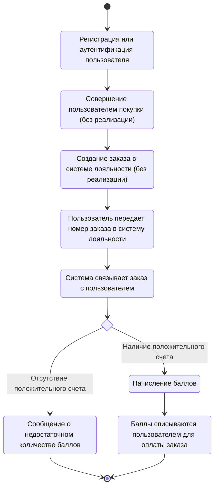

## Схема взаимодействия с системой

```mermaid
stateDiagram-v2
   Регистрация: Регистрация или аутентификация пользователя
   Покупка: Совершение пользователем покупки (без реализации)
   Создание_заказа: Создание заказа в системе лояльности (без реализации)
   Передача_номера_заказа: Пользователь передает номер заказа в систему лояльности
   Связывание_заказа: Система связывает заказ с пользователем
   state Начисление_баллов <<choice>> 
   Положительный_счет: Начисление баллов
   Неположительный_счет: Сообщение о недостаточном количестве баллов
   Списывание_баллов: Баллы списываются пользователем для оплаты заказа

   [*] --> Регистрация
   Регистрация --> Покупка
   Покупка --> Создание_заказа
   Создание_заказа --> Передача_номера_заказа
   Передача_номера_заказа --> Связывание_заказа
   Связывание_заказа --> Начисление_баллов
   Начисление_баллов --> Положительный_счет : Наличие положительного счета
   Начисление_баллов --> Неположительный_счет : Отсутствие положительного счета
   Положительный_счет --> Списывание_баллов
   Неположительный_счет --> [*]
   Списывание_баллов --> [*]

```
